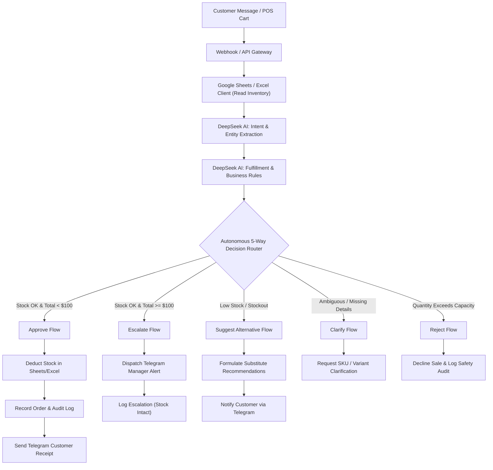

# Elora POS — Autonomous AI Retail Operations Agent

[](https://www.python.org/)
[](https://flask.palletsprojects.com/)
[](https://platform.deepseek.com/)
[](https://n8n.io/)
[](https://core.telegram.org/bots/api)
[](LICENSE)

An enterprise-ready **Autonomous AI Operations Agent** designed for retail store registers and Point of Sale (POS) terminals. Powered by **DeepSeek LLM**, **n8n visual workflow orchestration**, **Telegram Bot notifications**, and **real-time Google Sheets / Excel spreadsheet inventory synchronization**.

The system automates the complete order lifecycle: understanding conversational customer inquiries, validating live stock, enforcing store financial controls, generating digital e-receipts, and dispatching real-time management alerts.

---

## 📑 Table of Contents
- [Executive Overview](#-executive-overview)
- [Architecture & Workflow](#-architecture--workflow)
- [Autonomous 5-Way Decision Tree](#-autonomous-5-way-decision-tree)
- [Key Features](#-key-features)
- [Project Structure](#-project-structure)
- [Quick Start Guide](#-quick-start-guide)
  - [1. Installation & Environment Setup](#1-installation--environment-setup)
  - [2. Launching the POS Web Terminal](#2-launching-the-pos-web-terminal)
  - [3. Running n8n Orchestration](#3-running-n8n-orchestration)
  - [4. CLI & Demo Mode](#4-cli--demo-mode)
- [Live Demo Test Scenarios](#-live-demo-test-scenarios)
- [License](#-license)

---

## 🚀 Executive Overview

Retail businesses face persistent operational friction:
1. **Manual Checkouts & Slow Customer Communication:** Store clerks spend valuable time manually answering inventory questions and drafting sales receipts.
2. **Stockouts & Overselling:** Disconnected sales registers fail to update warehouse and backstock spreadsheets synchronously.
3. **Approval Bottlenecks:** High-value transactions either stall waiting for physical manager sign-offs or bypass risk controls entirely.

**Elora POS Operations Agent** eliminates these bottlenecks by integrating an intelligent agentic reasoning engine directly into the checkout workflow.

---

## 🧠 Architecture & Workflow

The architecture supports dual execution: a lightweight Python/Flask interactive web register and an enterprise 18-node **n8n workflow**.



---

## 🎯 Autonomous 5-Way Decision Tree

The agent evaluates every transaction against store governance rules and autonomously routes the execution path:

| Decision Branch | Condition Trigger | Autonomous Agent Action | Stock Impact | Telegram Event |
| :--- | :--- | :--- | :---: | :--- |
| **`Approve`** | Sufficient stock & Total < \$100 | Auto-fulfills order, logs sale, outputs POS digital receipt. | **Decremented** | Instant Customer E-Receipt |
| **`Escalate`** | Sufficient stock & Total ≥ \$100 | Pauses auto-fulfillment, locks transaction, flags for manager review. | *Untouched* | Store Manager Review Alert |
| **`Suggest Alternative`** | Requested variant stock < quantity | Checks backstock catalog for available alternative color/scent variants. | *Untouched* | Customer Substitution Offer |
| **`Clarify`** | Unrecognized SKU or missing details | Halts fulfillment safely without hallucinating catalog items. | *Untouched* | Customer Clarification Request |
| **`Reject`** | Quantity exceeds total store capacity | Autonomously declines sale to protect from catastrophic overselling. | *Untouched* | Customer Order Rejection Notice |

---

## ✨ Key Features

- **Split-Screen Modern POS Terminal (`http://localhost:5000`):**
  - Instant product catalog grid with visual stock badges (Normal, Low Stock, Out of Stock).
  - Multi-item cart management with incremental quantity adjusters and hold ticket support.
  - Dual currency calculation: Real-time conversion between US Dollar (`$`) and Khmer Riel (`៛`, exchange rate: 1 USD = 4,100 KHR).
  - 1-click Preset Demo chips to trigger all 5 autonomous branches instantly.
- **18-Node n8n Workflow (`workflows/order-agent-workflow.json`):**
  - Production-grade visual orchestration with Webhooks, DeepSeek AI reasoning, Google Sheets nodes, Switch routers, and Telegram notification dispatchers.
- **Persistent Dual Database (Excel & Google Sheets):**
  - Real-time bidirectional synchronization with local `inventory.xlsx` (featuring in-memory cache resilience to prevent Windows file-lock contention).
  - Out-of-the-box support for Google Cloud service accounts and Google Sheets API.
- **Instant Telegram Dispatcher (`@business0psBot`):**
  - Beautifully formatted HTML receipts with order IDs, item breakdowns, total values, and manager override alerts.
- **Immutable Audit Trail:**
  - Every decision, approval, escalation, and clarification is written with timestamps and UUIDs to the `Logs` sheet.

---

## 📂 Project Structure

```
ai-pos-operations-agent/
├── agent.py                     # Core AI Agent engine, DeepSeek client, and Sheets/Excel sync
├── web_app.py                   # Flask server powering POS interface and REST endpoints
├── inventory.xlsx               # Local persistent spreadsheet database (Products, Orders, Logs)
├── requirements.txt             # Python runtime dependencies
├── .env.example                 # Environment configuration template
│
├── templates/
│   └── index.html               # Elora POS modern retail web interface
│
├── workflows/
│   └── order-agent-workflow.json # 18-node n8n orchestration workflow
│
├── scripts/
│   ├── build_full_n8n_workflow.py # Programmatic generator for the 18-node n8n workflow
│   ├── init_excel_inventory.py   # Database initializer for inventory.xlsx
│   ├── capture_screenshots.py    # Automated UI documentation screenshot runner
│   └── generate_docx_report.py   # Word (.docx) project report compiler
│
├── docs/
│   ├── AI_Business_Operations_Agent_Report.docx # Comprehensive project submission report
│   ├── AI_Business_Operations_Agent_Report.pdf  # Final PDF report
│   └── full-report.md           # Markdown report documentation
│
└── screenshots/                 # High-resolution UI captures & workflow diagrams
    ├── 00_workflow_diagram.png
    └── 01_web_ui_dashboard.png
```

---

## 🛠️ Quick Start Guide

### 1. Installation & Environment Setup

Clone the repository and install dependencies:

```bash
git clone https://github.com/mengchheanglong/ai-pos-operations-agent.git
cd ai-pos-operations-agent

# Create and activate virtual environment
python -m venv venv
# Windows:
.\venv\Scripts\activate
# macOS/Linux:
source venv/bin/activate

# Install required packages
pip install -r requirements.txt
```

Create your `.env` file from the example:

```bash
cp .env.example .env
```

Configure your `.env` variables:

```env
# AI Reasoning
DEEPSEEK_API_KEY=your_deepseek_api_key_here

# Telegram Notifications
TELEGRAM_BOT_TOKEN=your_telegram_bot_token_here
TELEGRAM_CHAT_ID=your_customer_chat_id
TELEGRAM_OWNER_CHAT_ID=your_manager_chat_id

# Google Sheets (Optional — defaults automatically to local inventory.xlsx)
GOOGLE_SHEET_ID=your_google_sheet_id
GOOGLE_CREDENTIALS_FILE=credentials.json
```

---

### 2. Launching the POS Web Terminal

Start the Flask application:

```bash
python web_app.py
```

Open your browser at **`http://localhost:5000`**. You will be greeted by the **Elora POS** register interface.

---

### 3. Running n8n Orchestration

If you prefer visual low-code orchestration:

```bash
# Install n8n globally if not already installed
npm install -g n8n

# Start n8n
n8n start
```

1. Open **`http://localhost:5678`**.
2. Click **Add Workflow** -> **Import from File**.
3. Select `workflows/order-agent-workflow.json`.
4. Configure your DeepSeek and Google Sheets/Telegram credentials.
5. Click **Publish / Activate**.

---

### 4. CLI & Demo Mode

You can run automated test scenarios via the command line:

```bash
# Run interactive CLI agent:
python agent.py

# Run batch test suite covering all decision paths:
python demo.py
```

---

## 🎬 Live Demo Test Scenarios

Use these presets directly on the POS UI (`http://localhost:5000`) or via natural language search:

| Scenario | Input Message | Expected Outcome |
| :--- | :--- | :--- |
| **⚡ Fast Sale (<$100)** | `"I want 2 black Basic Shirts"` | **Auto-Approved:** Total = \$20. Stock decremented in `inventory.xlsx`, digital receipt displayed and sent via Telegram. |
| **⚠️ Manager Override (≥$100)** | `"I need 12 black Basic Shirts"` | **Escalated:** Total = \$120. Triggers Manager Override alert via Telegram; inventory remains safe until authorized. |
| **📦 Out-of-Stock Alt** | `"I want 25 black Basic Shirts"` | **Alternative Offered:** Shelf stock insufficient (only 19 available). Agent recommends available White/Red variants. |
| **❓ Clarify SKU** | `"Do you have blue jeans?"` | **Clarification Required:** Blue jeans are not in catalog. Agent requests SKU/color clarification without hallucinating. |
| **❌ Reject Sale** | `"I need 1000 red shirts immediately"` | **Rejected:** 1,000 units exceeds total store inventory capacity. Agent declines sale to prevent overselling. |

---

## 📄 License

This project is licensed under the **MIT License** — see the [LICENSE](LICENSE) file for details.

Developed with ❤️ for the AI Business Operations Internship.
